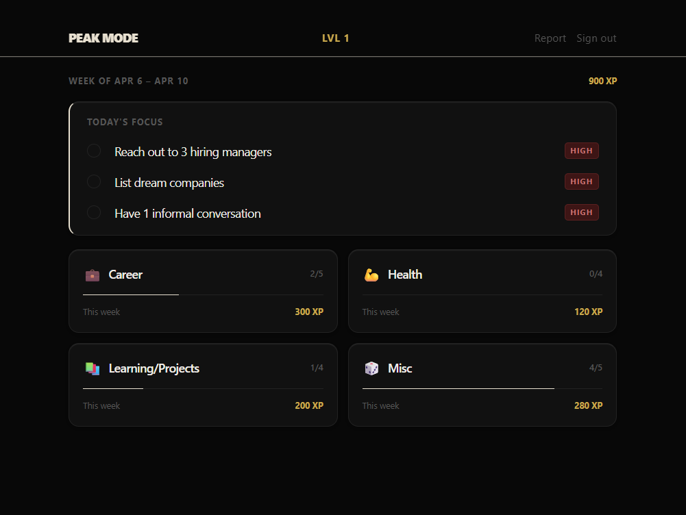
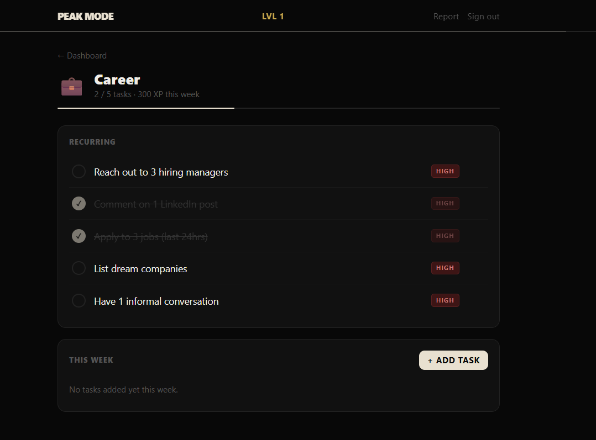

# Peak Mode

**A gamified personal productivity system built for people who are juggling too many goals at once.**



---

## Why I Built This

I was deep in a job search while trying to stay on top of fitness goals, side projects, and life admin — and I was drowning. Not because any single task was hard, but because there was no system connecting everything. I'd crush my job applications one week and completely drop my health goals. The next week I'd flip. Nothing stuck.

I needed something that treated all my goals as one interconnected performance system — not just another to-do list, but something that made me *want* to show up every day. So I built Peak Mode: a productivity tool framed around the metaphor of an elite athlete training for peak performance. Every task completed earns XP. Every day you show up extends your streak. Every week ends with a performance report.

It works. I actually use it.

## What It Does

Peak Mode organizes your life into **four arenas** — Career, Health, Learning/Projects, and Misc — each with their own recurring and one-off tasks, priority levels, and weekly progress tracking.

### Core Features

- **Four Life Arenas** — Career (job search + professional development), Health (fitness, nutrition, meditation), Learning/Projects (side hustles, skill-building), and Misc (taxes, errands, everything else). Each arena tracks progress independently with its own XP tally.

- **Smart Task System** — Daily recurring tasks reset each morning (Mon–Fri). Weekly tasks track count-based goals like "strength training 4x this week" with progress indicators (2/4). Misc tasks can be added, edited, and deleted freely each week.

- **Priority Engine** — Tasks are auto-assigned priority levels (High, Medium, Optional) based on their arena. Users can override any priority at any time. The "Today's Focus" panel surfaces the top uncompleted high-priority tasks so you always know what matters most right now.

- **XP and Leveling** — Every completed task earns XP scaled by priority (High = 100, Medium = 60, Optional = 30). XP accumulates toward levels. The header always shows your current level and weekly XP total.

- **Streak Tracking** — Consecutive days of completing all high-priority tasks builds your streak. Missing a day triggers a "form dip" warning — visible but not punishing.

- **AI-Powered Hype Messages** — Completing a task triggers a Claude API-generated motivational message via XP toast animation. Small dopamine hit, every time.

- **Weekly Performance Report** — An AI-generated end-of-week breakdown covering tasks completed vs. total, XP earned, streaks held, and an arena-by-arena analysis with personalized insights and encouragement.

- **Full Task Management** — Add new tasks to any arena, edit task titles and priorities, delete tasks with confirmation. Recurring tasks warn before permanent changes.

- **PWA** — Installable on desktop and mobile. Works from the home screen like a native app with no browser chrome.



## Tech Stack

| Layer | Technology | Why |
|-------|-----------|-----|
| Frontend | React + Vite | Fast builds, modern React 19 with hooks |
| Styling | Tailwind CSS | Utility-first, dark theme with custom design tokens |
| Backend/Auth | Supabase | Postgres database, Row Level Security, email/password auth |
| AI | Claude API (via Vercel Serverless Functions) | Hype messages on task completion, weekly report generation |
| Hosting | Vercel | Free tier, automatic deployments, serverless API routes |
| Mobile | PWA (Service Worker + Web Manifest) | Installable on any device, no app store needed |

## Architecture

```
┌─────────────────────────────────────────────────┐
│                   Vercel                         │
│  ┌──────────────┐    ┌───────────────────────┐  │
│  │  React SPA   │    │  Serverless Functions  │  │
│  │  (Vite PWA)  │    │  /api/hype             │  │
│  │              │    │  /api/weekly-report     │  │
│  └──────┬───────┘    └──────────┬────────────┘  │
└─────────┼───────────────────────┼────────────────┘
          │                       │
          ▼                       ▼
   ┌──────────────┐      ┌──────────────┐
   │   Supabase   │      │  Claude API  │
   │  (Postgres)  │      │  (Anthropic) │
   │  + Auth      │      │              │
   └──────────────┘      └──────────────┘
```

**Key design decisions:**
- Claude API key lives server-side in Vercel serverless functions — never exposed to the browser
- Supabase Row Level Security on every table — users can only access their own data
- Task completion timestamps stored for full historical tracking
- Weekly reports persisted in the database so past weeks are always browsable
- `COALESCE(priority_override, priority)` pattern for clean priority overrides without schema complexity

## Database Schema

Five core tables:

- **profiles** — User level, total XP, streak data, linked to Supabase auth
- **arenas** — The four life domains (seeded, not user-editable)
- **tasks** — Both recurring and misc tasks with priority, recurrence type, and weekly targets
- **task_completions** — Immutable log of every task completion with timestamp and XP earned
- **weekly_reports** — AI-generated weekly summaries with arena breakdowns stored as JSONB

## Running Locally

```bash
# Clone the repo
git clone https://github.com/ashwin-raman-oss/peak-mode.git
cd peak-mode

# Install dependencies
npm install

# Set up environment variables
cp .env.example .env.local
# Fill in your Supabase URL, anon key, and Anthropic API key

# Run the Supabase migrations
# Paste contents of supabase/migrations/001_schema.sql into your Supabase SQL editor
# Then paste supabase/migrations/002_rls_triggers_seed.sql

# Start the dev server
npm run dev
```

## Design Philosophy

The UI is intentionally designed to feel like a premium health-tech product (think Whoop or Apple Fitness) rather than a gamified to-do app. Dark background (#080808), warm off-white accents (#E8E0D0), muted gold for XP indicators, ultra-thin progress bars, and subtle card depth through inner shadows and directional borders. The goal is a tool that feels sophisticated enough to open every morning without fatigue.

## Roadmap

This is a living project. Planned additions include:

- **Habit Tracker** — Track daily habits beyond task completion (sleep quality, water intake, screen time)
- **Personal Growth Goals** — Define things you want to change about yourself with milestone-based task sequences to get there
- **Historical Analytics** — Charts and trends across weeks and months showing progress patterns
- **Improved Weekly Reports** — Deeper AI insights with cross-arena pattern recognition
- **Notification System** — Browser push notifications for daily reminders and streak warnings

## Built With

This project was built end-to-end using [Claude Code](https://docs.anthropic.com/en/docs/claude-code) as an AI-powered development partner — from initial concept brainstorming through schema design, implementation, UI iteration, and deployment. The commit history reflects the real build process.

---

*Peak Mode is a personal project by [Ashwin Raman](https://github.com/ashwin-raman-oss). If you're interested in the product thinking behind it or want to chat about building with AI tools, feel free to reach out.*
